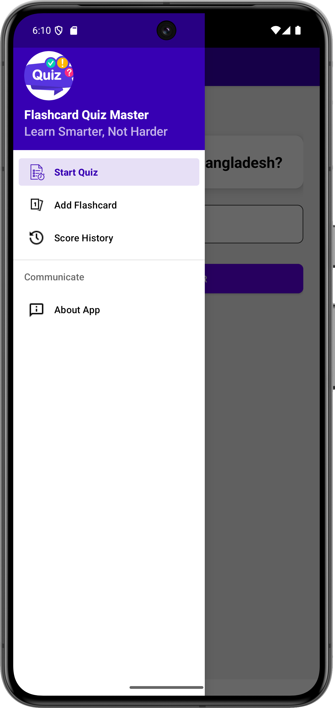
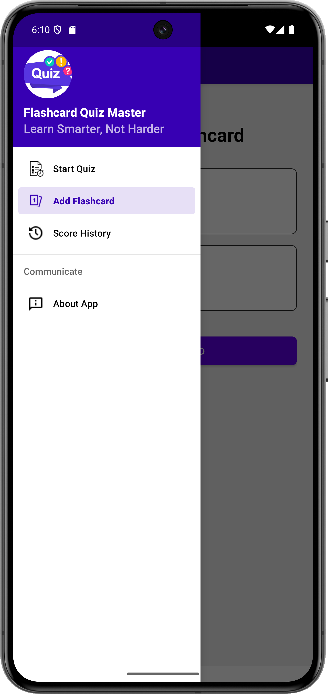
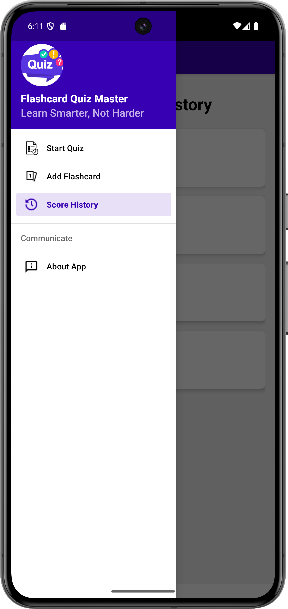
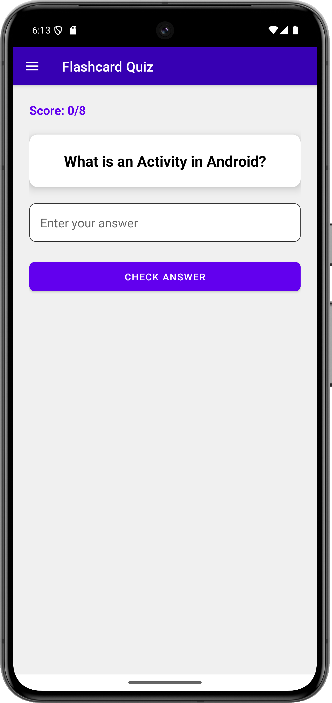
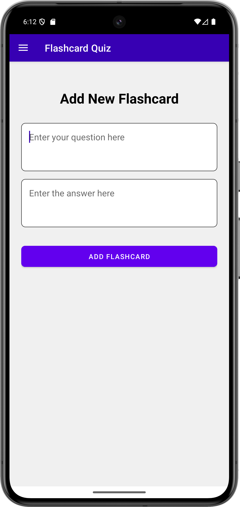
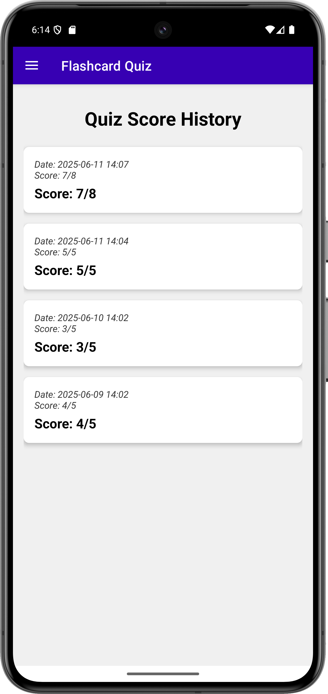
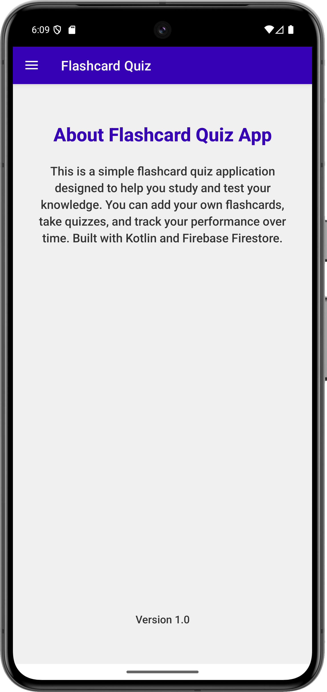

# 📚 Flashcard Quiz App

A simple and interactive **Flashcard Quiz App** for Android, designed to help users study and test their knowledge effectively. This application allows users to **create custom flashcards**, **quiz themselves**, and **track their scores** — all within a clean, intuitive interface featuring a **Navigation Drawer** for seamless navigation.

---

## ✨ Features

- 📝 **Custom Flashcards** – Add your own questions and answers to build personalized flashcard sets.
- ❓ **Interactive Quizzing** – Test yourself on your flashcards and receive instant feedback.
- 📊 **Score Tracking** – View your quiz results: correct answers out of total attempts.
- 🕓 **Quiz History** – Browse through previous quiz sessions and performance.
- 🧭 **Navigation Drawer** – Effortlessly navigate to Quiz, Add Flashcard, Score History, and About screens.
- 🎨 **Modern UI** – Built using Material Design components for a clean and intuitive user experience.
- 🛡 **Kotlin First** – Developed entirely in Kotlin for concise, expressive, and safe code.

---

## 📸 Screenshots

|   Drawer-Start-Quiz Screen   |   Drawer-Add-Flashcard Screen   |   Drawer-Score-History Screen   |
|------------------------------|---------------------------------|---------------------------------|
|  |  |  |

|   QuizView Screen   |   Add Flashcard Screen   |
|---------------------|--------------------------|
|  |  |

|   Score History Screen   |   AboutPage Screen   |
|--------------------------|----------------------|
|  |  |

---

## 🛠️ Technologies Used

- **Kotlin** – Primary language
- **Android SDK**
- **AndroidX Libraries**
  - `androidx.appcompat`
  - `androidx.constraintlayout`
  - `androidx.fragment`
  - `androidx.recyclerview`
  - `androidx.drawerlayout`
- **Material Components**
  - `com.google.android.material` (NavigationView, CardView, Buttons, Toolbar)

---

## 🚀 Getting Started

### ✅ Prerequisites

- Android Studio (Bumblebee or newer recommended)
- An Android device or emulator with **API level 21+**

### 🔧 Installation Steps

```bash
git clone https://github.com/your-username/FlashcardQuizApp.git
cd FlashcardQuizApp
