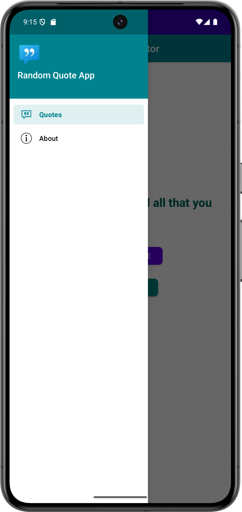
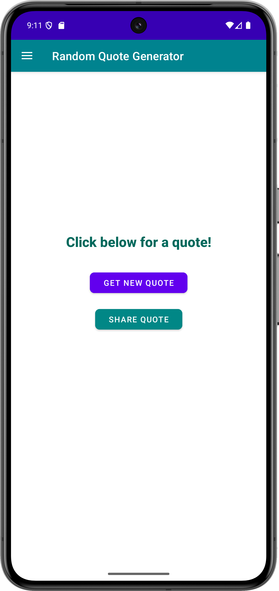
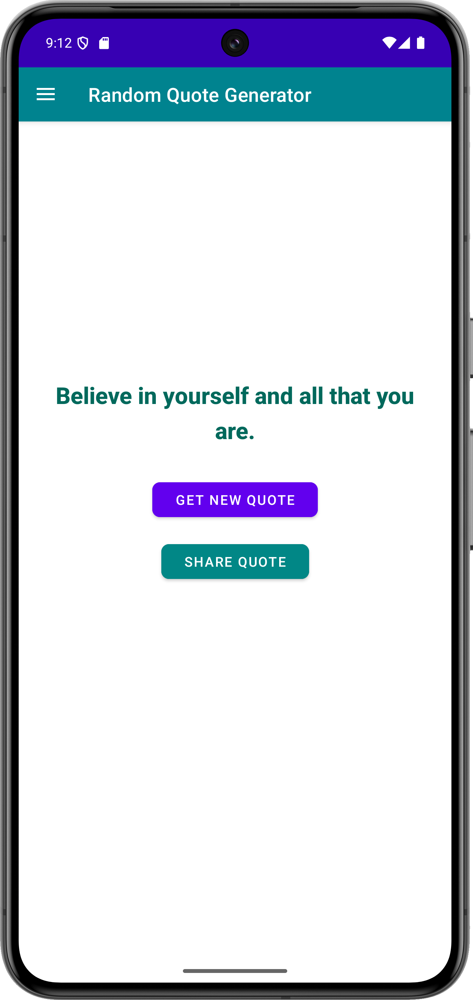
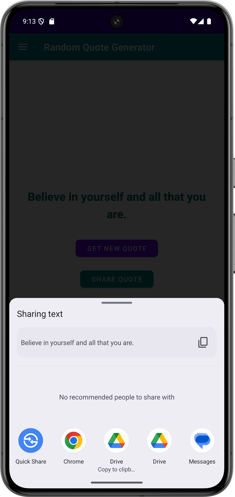
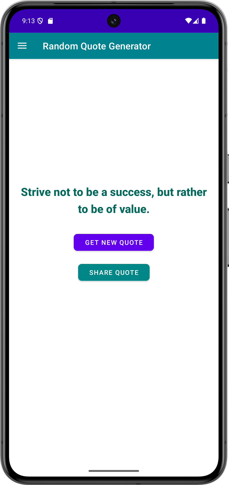
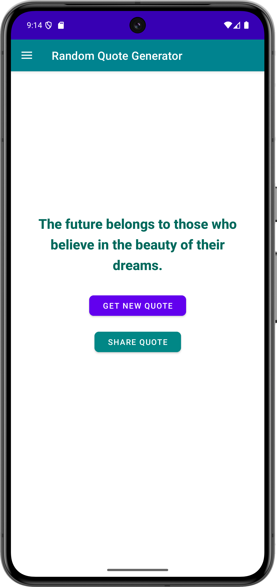
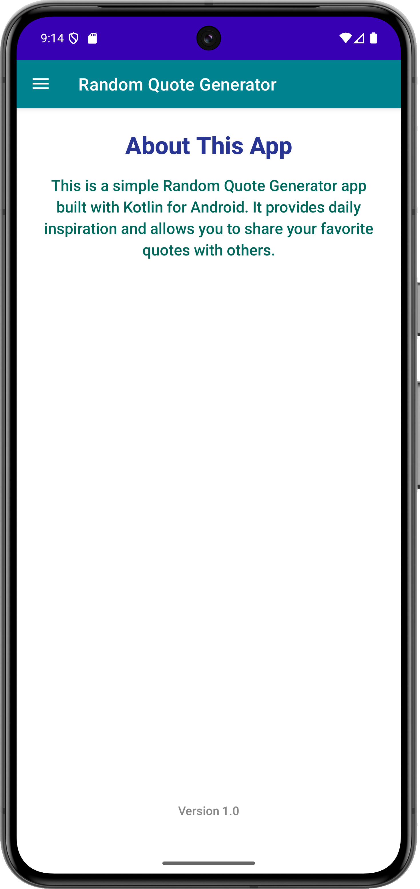

# ✨ Random Quote Generator

A simple, elegant Android application built with **Kotlin** that delivers a daily dose of inspiration through random quotes. The app features a clean and minimal UI with a **Navigation Drawer** for smooth access to different sections and the ability to **share quotes** with friends.

---

## 📱 Features

- 🎲 **Random Quote Generation** – Get an inspiring quote with a single tap.
- 📤 **Share Functionality** – Share your favorite quotes with friends via social media or messaging apps.
- 🧭 **Navigation Drawer** – Navigate easily between Quotes, About, and other sections.
- 🎨 **Modern UI/UX** – Clean and user-friendly design using Material Design.
- 🛡 **Kotlin First** – Written entirely in Kotlin with safe and concise code.

---

## 📸 Screenshots

|   Drawer-Quotes Screen   |   Drawer-About Screen   |
|--------------------------|-------------------------|
|  |  |

|  Home Screen-01   |  Home Screen-02   |   Home Screen-03   |
|-------------------|-------------------|--------------------|
|  |  |   |

|   Home Screen-04   |   Home Screen-05   |
|--------------------|--------------------|
|  |  |

| About Screen |
|----------------|
|  |

---

## 🛠️ Technologies Used

- **Kotlin** – Main development language.
- **Android SDK**
- **Jetpack & AndroidX Libraries**:
  - `androidx.appcompat`
  - `androidx.constraintlayout`
  - `androidx.drawerlayout`
  - `androidx.fragment`
- **Material Design Components**:
  - `com.google.android.material` (NavigationView, Toolbar, Buttons)

---

## 🚀 Getting Started

### ✅ Prerequisites

- Android Studio Bumblebee (or newer)
- Android device or emulator (API 21+)

### 🔧 Installation Steps

```bash
git clone https://github.com/SaadMahmud-CSE/RandomQuoteGenerator.git
cd RandomQuoteGenerator
